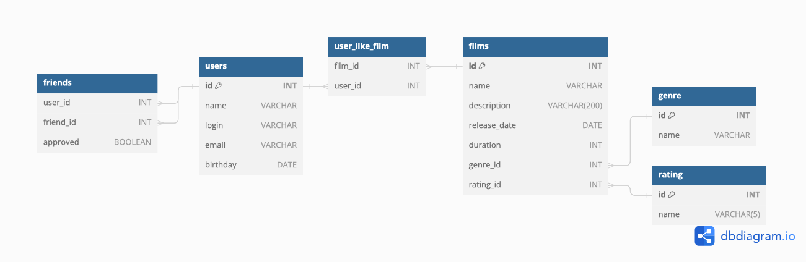

# Filmorate



## Tables description

- ### users - Stores information about users

| Column     | Type    | Constraint                                         | Description                                          |
|------------|---------|----------------------------------------------------|------------------------------------------------------|
| `id`       | INT     | Primary key                                        | Unique identifier for each user                      |
| `name`     | VARCHAR | If null or empty, must be equal to the login value | Full name of the user                                |
| `login`    | VARCHAR | Unique, not null and not empty                     | Login username for user authentication               |
| `email`    | VARCHAR | Unique, must adhere to a specific format           | Email used for user communication and authentication |
| `birthday` | DATE    | Date value cannot be in the future                 | User's date of birth                                 |

&nbsp;

- ### films - Stores information about films

| Column         | Type         | Constraint                            | Description                     |
|----------------|--------------|---------------------------------------|---------------------------------|
| `id`           | INT          | Primary key                           | Unique identifier for each film |
| `name`         | VARCHAR      | -                                     | Name of the film                |
| `description`  | VARCHAR(200) | A maximum length is of 200 characters | Description of the film         |
| `release_date` | DATE         | Must be after December 28, 1985       | Release date of the film        |
| `duration`     | INT          | Must be a positive value              | Duration of the film            |
| `genre_id`     | INT          | Foreign key references genre table    | Identifier for genre            |
| `rating_id`    | INT          | Foreign key references rating table   | Identifier for rating           |

&nbsp;

- ### genre - Catalog of film genres

| Column | Type    | Constraint  | Description                      |
|--------|---------|-------------|----------------------------------|
| `id`   | INT     | Primary key | Unique identifier for each genre |
| `name` | VARCHAR | -           | Name of the genre                |

&nbsp;

- ### rating - Catalog of film rating

| Column | Type       | Constraint  | Description                       |
|--------|------------|-------------|-----------------------------------|
| `id`   | INT        | Primary key | Unique identifier for each rating |
| `name` | VARCHAR(5) | -           | Name of the rating                |

&nbsp;

- ### friends - Manages friendships between users

| Column      | Type    | Constraint | Description                                       |
|-------------|---------|------------|---------------------------------------------------|
| `user_id`   | INT     | -          | User ID of the user initiating the friend request |
| `friend_id` | INT     | -          | User ID of the friend being added                 |
| `approved`  | BOOLEAN | -          | Approval status of the friendship                 |

&nbsp;

- ### user_like_film - Tracks user interactions by capturing likes for films.

| Column    | Type | Constraint | Description                       |
|-----------|------|------------|-----------------------------------|
| `film_id` | INT  | -          | ID of the film being liked        |
| `user_id` | INT  | -          | ID of the user who likes the film |

&nbsp;

---

## Sample Queries

- Get all users

```sql
   SELECT * FROM users;
```

- Get films released after a specific date:

```sql
   SELECT * FROM films WHERE release_date > '2020-01-20';
```

- Get films with a specific genre:

```sql
   SELECT f.* FROM films f
     JOIN genre g ON f.genre_id = g.id
    WHERE g.name = 'Мультфильм';
```

- Get all friendships where the user initiated the friend request

```sql
   SELECT * FROM friends WHERE user_id = {user_id};
```

- Get users who have liked a specific film

```sql
   SELECT u.* FROM users u
     JOIN user_like_film ulf ON u.id = ulf.user_id
    WHERE ulf.film_id = {film_id};
```

- Get the total number of likes for each film

```sql
   SELECT film_id, COUNT(*) as like_count FROM user_like_film GROUP BY film_id;
```

- Get films sorted by their release date in ascending order

```sql
   SELECT * FROM films ORDER BY release_date;
```

- Get common friends between two users

```sql
   SELECT f1.friend_id as common_friend_id, u.name as common_friend_name
     FROM friends f1
     JOIN friends f2 ON f1.friend_id = f2.friend_id
     JOIN users u on u.id = f1.friend_id
    WHERE f1.user_id = {user_id} and f2.user_id = {user_id} and f1.status = true
```

- Get 5 popular films

```sql
   SELECT f.id, f.title, COUNT(ulf.user_id) as like_count
     FROM films f
LEFT JOIN user_like_film ulf ON f.id = ulf.film_id
 GROUP BY f.id, f.title
 ORDER BY like_count DESC
    LIMIT 5;
```